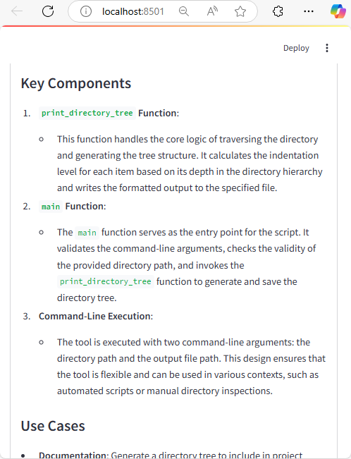

# DOCU-TIGER

**Agentic AI-Powered Project Code Documentation**

This project is an agentic AI tool designed to autonomously generate comprehensive documentation for Python project workspaces. The system leverages multiple specialized agents to scan folder structures, process code files, and generate documentation sections—including high-level descriptions, module details, and external dependency requirements. It also incorporates a robust user-feedback loop for dynamic, adaptive re‑prompting to improve the output based on user input. **Note: This is a personal project demonstrating generative AI skills and is not intended for commercial use.**

## Overview

The tool features:
- **Dynamic Orchestration:** An orchestrator dynamically invokes specialized agents to process code files, refine module details, extract external dependencies, and generate a high-level project overview.
- **Self-Evaluation & Adaptive Re-Prompting:** The system evaluates agent outputs (using minimum quality criteria) and re-prompts if needed to ensure high-quality documentation.
- **User Feedback Loop:** After generating documentation, users can review each section and provide actionable feedback through an integrated feedback interface. A dedicated feedback agent then uses this input to re‑generate improved sections, ensuring the final documentation meets the user's expectations.
- **Noise Filtering:** The tool automatically skips sensitive files (such as `.env` and `.gitignore`) and irrelevant folders (e.g., `.git`, `__pycache__`, `.pytest_cache`) while still listing them in the folder structure.
- **Modular Design:** Each task—folder scanning, file processing, requirements extraction, module documentation, and high-level summary generation—is handled by a dedicated agent for maintainability and flexibility.

## Installation

1. **Clone the Repository:**

   ```bash
   git clone https://github.com/yourusername/project_documentation_tool.git
   cd project_documentation_tool
   ```

2. **Install Dependencies:**

   Ensure you have Python 3.7 or later installed. Then, install the required packages:

   ```bash
   pip install -r requirements.txt
   ```

3. **Configure Environment Variables:**

   Create a `.env` file in the root directory and add your Deepseek API key:

   ```env
   DEEPSEEK_API_KEY=your_deepseek_api_key_here
   ```

## Usage

The tool runs as a Streamlit application. To start the application, run:

```bash
python main.py
```

- **Enter Project Folder:** Provide the absolute path of the project folder you wish to document.
- **Generate Documentation:** The tool will scan the folder, process all Python files, and generate documentation sections.
- **Review & Provide Feedback:** After initial generation, review each section and use the provided text boxes to submit any feedback. The system will adapt the output based on your input using a dedicated feedback agent.
- **Download Documentation:** Once finalized, download the consolidated Markdown documentation.

## Code Writing & Tools

The code for this project was developed with the assistance of:
- **o3-mini-high**
- **GitHub Copilot**

## Collaboration

If you have questions, queries, or are interested in collaborating on other projects, please feel free to reach out.

## Contact

Built by **Amit Mohite** – Techno-Functional Leader in AI/Automation Ops Transformation
GitHub: https://github.com/mohiteamit | LinkedIn: linkedin.com/in/amitmohite
Email: [mohite.amit@gmail.com](mailto:mohite.amit@gmail.com)

## License

This project is licensed under the MIT License. See the [LICENSE](LICENSE) file for details.

## Screenshots & Demo

Below are some screenshots of the application in action:





## Demo video
<video controls src="images/demo.mp4" title="Demo video"></video>
